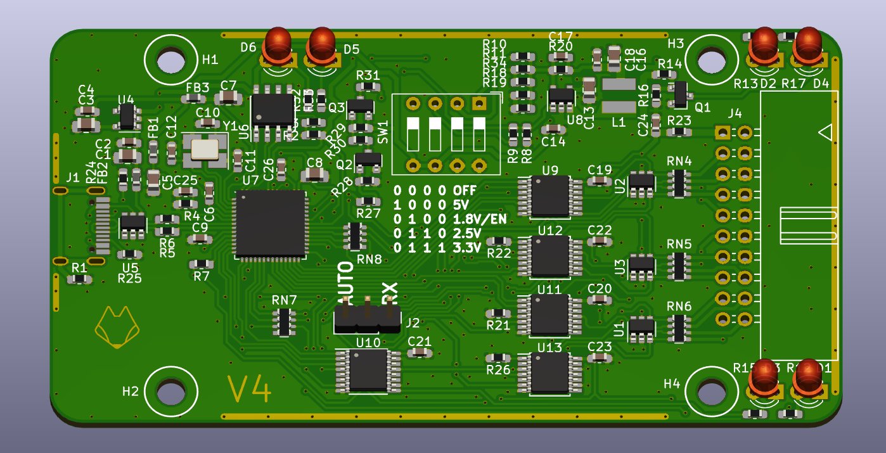
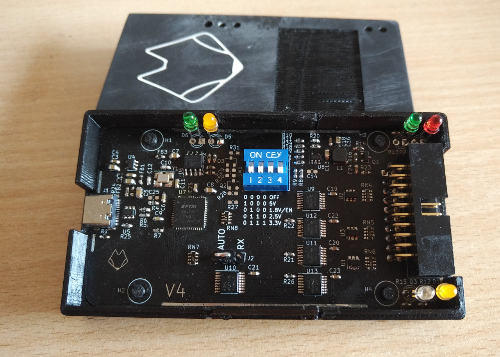
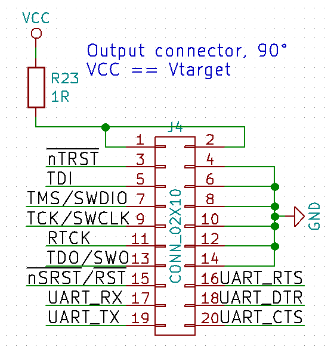
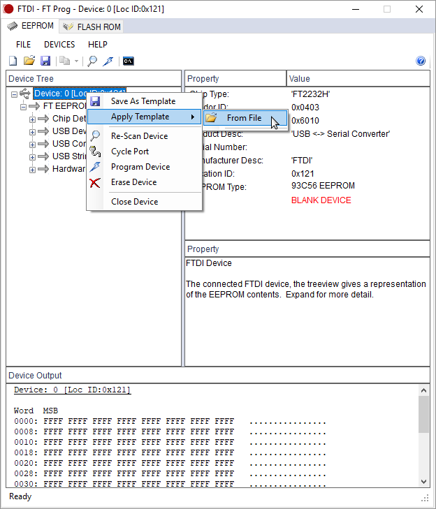
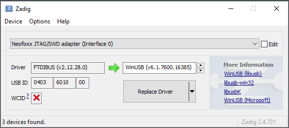

# JTAG-SWD-adapter
Universal JTAG/SWD/UART adapter based on FT2232H

#### PCB view

#### Finished product

### Pinout

## Description
This is a universal JTAG/SWD/UART/SPI/... adapter based around the FT2232H chip.
This initially started based off the KT-Link specifications, but has since evolved into the following set of features:

- USB Type-C connector
- 1.8V - 5V traget supply
- JTAG and SWD support on channel A, UART support on channel B.
- ESD protection of USB and of target
- Integrated power section, to power target from the adapter (5V/3.3V/2.5V/1.8V available)
- Similar pinout to the standard found on commercial JTAG/SWD adapters, with the addition of UART pins
- JTAG/SWD programming with simultaneous UART communication
- LEDs for USB power, Target power, SWD interface, Activity, and RX&TX of the UART

The design has been tested and confirmed working with OpenOCD.
Tested targets so far have been STM32F1 (SWD), STM32F3 (SWD), ESP32 (JTAG), and PIC32MX (JTAG)

## Component selection & BOM

Components were selected based on the desire to try them out, usually based on price/performance. FT2232H and its support circuitry should not be changed, but other things (series resistors, LEDs, DCDC chip) can be changed & exprimented with without issue.

## Setup (1/2) - EEPROM

After soldering the board together and verifying for no shorts, plug the debugger into your computer, and verify that it shows up. With no parameters in the EEPROM, it should show up as a generic FT2232H Dual UART device.

You can find the relevant files in the Setup folder.

### Windows

Use the provided "Neofoxx FT-Prog template.xml".
- Connect the device to your computer. Verify that VCP drivers for FT2232H are installed
- Open FT-Prog. Click on "Devices" -> "Scan and Parse"
- The device should now show up
- Right clock on your device, and select "Apply template". Choose the template in the first step.
- Afterwards, right-click on the device again, and select "Program". Confirm again that you want to progam the device.
- After programming, unplug & re-plug your device. Wait for driver installation.
- In FT-Prog, perform another "Scan and Parse".
- Confirm the device has the proper parameters.
- Success!

### Linux

- Use the provided "Neofoxx_ftdi_eeprom.conf". 
- (Feel free to change the serial number, but do not increase the number of characters)
- Install/build libftdi1 from https://www.intra2net.com/en/developer/libftdi/download.php
- (Link for reference, if you run into trouble: https://www.acmesystems.it/CM3-HOME_ft4232_setup )
- Flash the eeprom with the following command: `ftdi_eeprom --device i:0x0403:0x6010 --flash-eeprom Neofoxx_ftdi_eeprom.conf`
- Run the command again. Afterwards, unplug & re-plug the device.
- With dmesg or similar, you can check that the attached device now has the proper Manufacturer and Description string 
- Alternatively, in the examples folder, run the `eeprom` utility, and see what it outputs.

#### Known issues

- FT-Prog and ftdi_eeprom do not write 100% identical settings. The adapter will work nonetheless.
- If flashed with ftdi_eeprom, then checked in FT-Prog, the device will LOSE ITS PARAMETERS. In that case, upload them again in FT-Prog. If you don't check it in FT-Prog, it will work in Windows just fine. (Possible issue, that ftdi_eeprom doesn't write the eeprom type?)
- If you manage to mangle the parameters, and your VID/PID is suddenly 0000:0000, you can revive the device with a Windows box (virtualization won't work, unless you can pass a device with 0000:0000 to it).
- -> Connect the device to a Windows box, and force install the VCP drivers on the "Unknown device"
- -> This should then allow you to see the device in FT-Prog, and allow you to erase the eeprom and flash it with the proper parameters.

## Setup (2/2) - OpenOCD settings

- Copy the neofoxx.cfg file into your openocd scripts/interface/ftdi/ folder.

### Linux

- Done!

### Windows

- If you want to use the adapter with OpenOCD under Windows, you will have to change its drievr from the FTDI one a WinUSB one.
- Download zadig from here: https://zadig.akeo.ie/
- Run the tool.
- If necessary, in the Options menu, select "List All Devices"
- Select "Neofoxx JTAG/SWD adapter (Interface 0)"
- Select WinUSB, then click Replace Driver.
- Done!
- Note, if you have multiple adapters connected at the same time and want to use them, you have to do this on all of them.
- If the adapter suddenly stops working under Windows, fist check if the driver has changed. Windows have a nasty habit of changing things without telling you.

## Normal operation and things to look out for

- To use SWD with this board, you need to pass the proper flags to OpenOCD. Try something like this `openocd -f interface/ftdi/neofoxx.cfg -c "transport select swd" -f target/stm32f1x.cfg -c "adapter_khz 1000"`
- Because the board is compliant to the standard pinout, it will, when used in SWD mode, connect the TDO line to the RX of the UART channel, to be used as SWO.
- -> If this is undesired, the jumper on the board can be moved from "Auto" to "RX". This way, the UART RX pin will always be the RX pin, bypassing the switching of pins.
- The adapter includes a power section to power the target
- -> The maximum current draw is limited with a 1 ohm resistor, to protect the PC.
- -> When changing voltages, first turn the EN/1.8V pin to off, then set the voltage, then enable it again.
- -> When using 5V, disable the EN/1.8V switch first (the other two do not matter), then enable the 5V switch. Also in this case, if you make a mistake and short a high voltage onto the VTarget rail, your computer is at risk. There is some protection, but it's your computer. If you suspect this might happen, replace the 1 ohm resistor with an SMD fuse.
- The USB/Power LED shines when the USB cable is plugged in (5V is present)
- The VTarget LED shines when the voltage on VTarget is over 0.7V
- The SWD LED shines when the SWD interface is selected
- The Acivity light is SW driven from OpenOCD or others.

## Housing
The housing has been designed with latches, so it can be quickly opened and closed. 3D printing with PLA has given the best results so far.
Be warned, the housing was designed with minimal tolerances, so it might be a snug fit.

## Future improvements:

- Possibly split the two Vtarget pins into two separate pins - possibility of powering the target with say 5V, while communication works on 1.8V, etc.
- Instead of rounded corners, use inverted rounded corners, or no rounding at all. This would reduce waste during production of PCBs, since they could be panelized more easily (just V-cut, no mouse bites required)
- Fixup ftdi_eeprom & FT-Prog differences
- Update schematic to newer version of KiCad, and not use rescue symbols.
- Test the power section & enabling via the FTDI. As it is, that is UNTESTED

